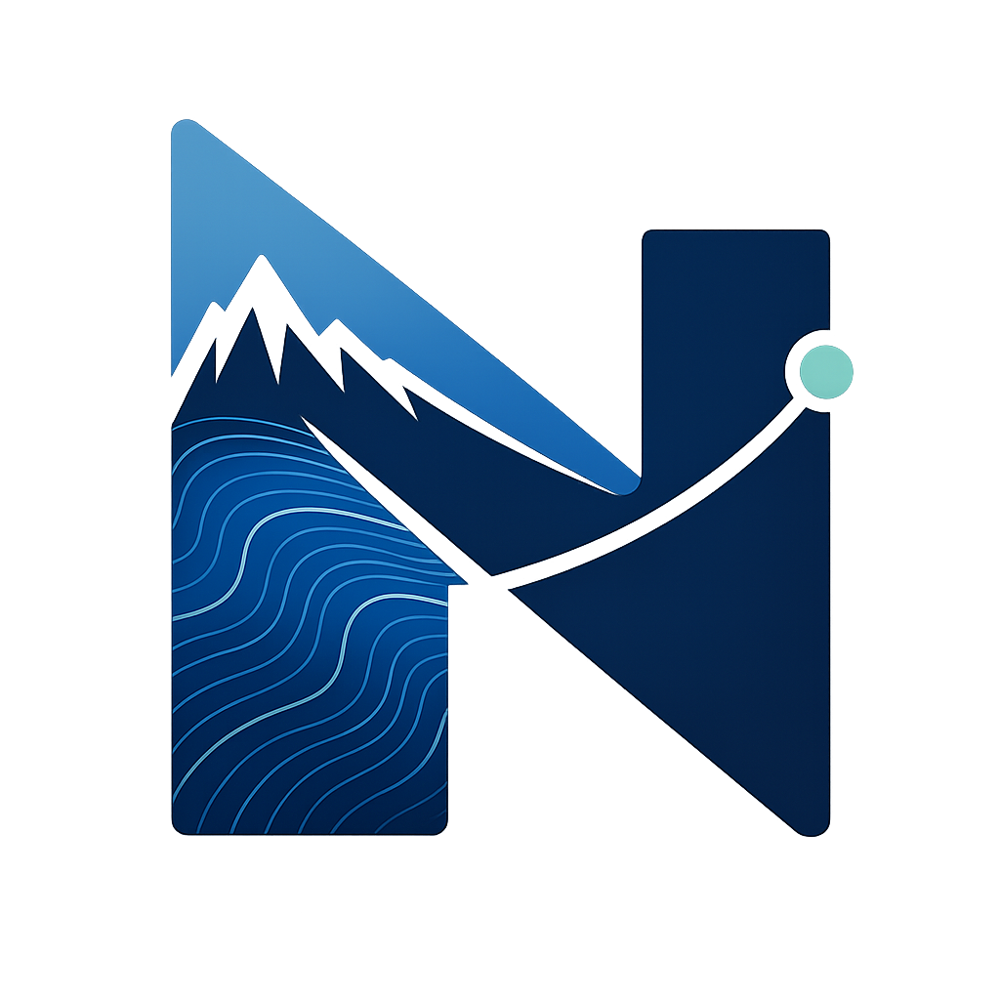

<p align="center">
  
</p>

# Nomad

Nomad connects AI agents to scientific foundation models (SciFMs). It serves
PyTorch-backed scientific tools over the [Model Context Protocol
(MCP)](https://modelcontextprotocol.io), and it can also expose MCP tools as
typed Python callables inside a code-execution sandbox.

[Documentation site](https://lanl.github.io/nomad) |
[Getting started](docs/guides/getting-started.md) |
[Model builder guide](docs/guides/model-builder.md) |
[Reference](docs/reference/index.md)

## What Nomad does

- Serve SciFMs and regular Python tools over MCP with `nomad serve`.
- Load model artifacts from Hugging Face, local storage, or Git/Git LFS.
- Proxy MCP servers into a Python sandbox with `nomad code-mode` and
  `nomad code-mode-exec`.
- Support both local workflows and hosting models on remote GPU servers.

## Install

Nomad requires Python 3.12 or newer.

For CLI use:

```shell
uv tool install --python 3.13 \
  git+https://github.com/lanl/nomad.git

nomad --help
```

For development from a checkout:

```shell
uv sync --all-groups
uv run nomad --help
```

## Quick start

Launch the example server directly in MCP Inspector using stdio:

```shell
npx @modelcontextprotocol/inspector -- \
  uv run --directory container/deploy/demo \
  nomad serve nomad.yml
```

For the streamable HTTP workflow and matching [URSA](https://github.com/lanl/ursa) configs, see
[Starting a Nomad server](docs/guides/getting-started.md#starting-a-nomad-server)
and
[Connect to a hosted Nomad server](docs/guides/getting-started.md#connect-to-a-hosted-nomad-server).

## Start here by task

| If you want to... | Start here |
| --- | --- |
| Connect to a running Nomad server | [Getting started](docs/guides/getting-started.md) |
| Host a new SciFM | [Model builder guide](docs/guides/model-builder.md) |
| Use Nomad for Inference | [Nomad inference notebook](docs/guides/nomad_inference.ipynb) |
| Browse CLI, config, and API docs | [Reference](docs/reference/index.md) |
| Run the demo deployment | [Deployments](docs/deployments/index.md) |
| Work on Nomad itself | [Developer docs](docs/guides/developer.md) |

## Development

Useful commands from a repo checkout:

```shell
uv run --only-group lint just lint
uv run --group dev just test
uv run --no-dev --group docs just docs
```

## Notice of Copyright Assertion (O5119)

© 2026. Triad National Security, LLC. All rights reserved.

This program was produced under U.S. Government contract 89233218CNA000001 for
Los Alamos National Laboratory (LANL), which is operated by Triad National
Security, LLC for the U.S. Department of Energy/National Nuclear Security
Administration. All rights in the program are reserved by Triad National
Security, LLC, and the U.S. Department of Energy/National Nuclear Security
Administration. The Government is granted for itself and others acting on its
behalf a nonexclusive, paid-up, irrevocable worldwide license in this material
to reproduce, prepare. derivative works, distribute copies to the public,
perform publicly and display publicly, and to permit others to do so.
